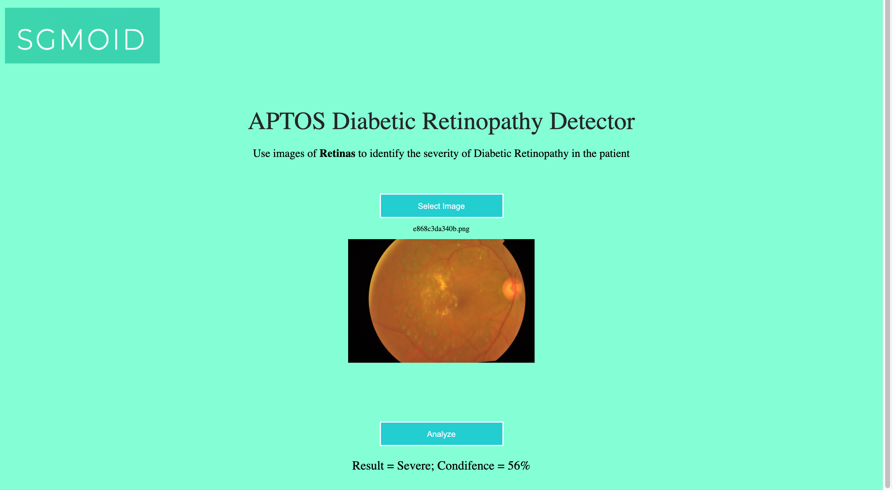

# Diabetic-Retinopathy-Detector

Computer Vision project using Transfer Learning with fast.ai and Pytorch to speed up the process for early detection of Diabetic Retinopathy in rural parts of India.

Link to the dataset:
https://drive.google.com/drive/folders/1SamPBFLQO3kQsMtVqyHDbAmVd8Vw9eB5

Validation accuracy of aptos.pkl in main.py ~92%. Techniques to achieve this accuracy included provessive resizing.

main.py was deployed in Google Cloud Platform as a Google Cloud Function to serve the UI. The API was created and called in client.js as a POST request.
